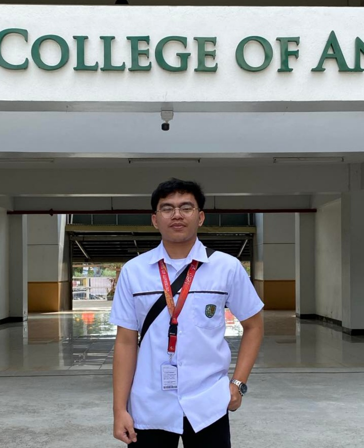

# 7OOP-Lab-Porfolio-
7OOP Lab task Portfolio 

## 🌟 Welcome to My 7OOP Portfolio 🌟

---

### 👤 ABOUT ME
Hello! I’m **Tan Pancho** 👋 
A Humble and friedly person and 
I’m a student currently learning **Object-Oriented Programming** in Python basic fundamentals. 

📸 Here’s a picture of me:  
  

  

---
### 💡 QUOTES
•*"Practice makes better"*

### 💡 AREA OF INTEREST & PROGRAMMING LANGUAGES
✨ My interests include:  
- 📱 Mobile Apps    
- 🎮 Game Development  

🖥️ Programming Languages I know: 

---

### 📂 PROJECT LINKS

---

### 🎉 FUN FACTS ABOUT ME
- 🏀 I love playing NBA2K Moblie    
- ☕ I don't like hot coffee

---

### 📱 CONTACTS
Let’s connect! 🌍  
- 👍 [Facebook](https://facebook.com/09632213477)  

---

